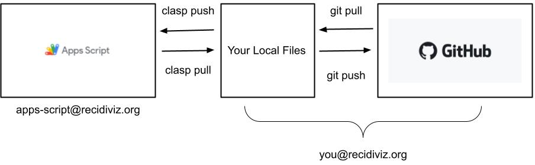
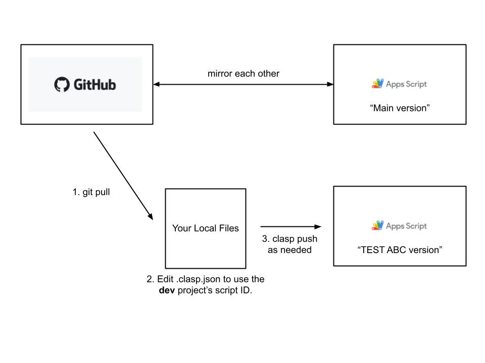
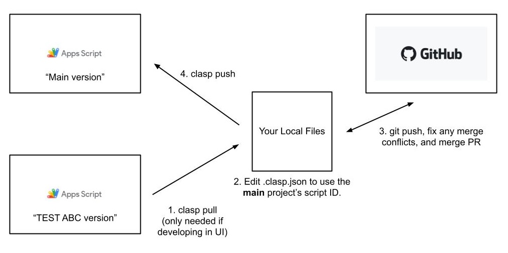

# Apps Script at Recidiviz

We use [Apps Script](https://developers.google.com/apps-script) to make scripts
that are integrated with Google Drive products, like Google Sheets and Google
Forms.

This directory contains one folder for each Apps Script project. A project is a
collection of files (typically JS scripts that run in the Apps Script platform)
that share a https://script.google.com link and various settings, such as
permissions and dependencies. A project may or may not be connected to a Google
Drive document/spreadsheet/form/etc. Functions in scripts can be run manually by
non-engineers in the [Apps Script UI](https://script.google.com), or triggered
on a schedule or by some action, such as submission of a connected Google Form
(see the Triggers tab in the left sidebar of the Apps Script UI).

## Dev environment setup

For communication about the Leadership Reports project, join the
#leadership-reports-eng and #leadership-reports-xfn Slack channels.

For communication about Login Email Reminders, join the #email-reminders-eng
Slack channel.

1. Download and install the
   [clasp library](https://github.com/google/clasp?tab=readme-ov-file#install).
   Clasp allows us to develop Apps Script projects locally, so we can check them
   into Github for code review and source control.

2. Log in to the apps-script@recidiviz.org email account by running the command
   `clasp login`. This should forward you to a webpage where you can sign into
   the apps-script@recidiviz.org account (password can be found in the
   [Shared 1Password vault](https://github.com/google/clasp?tab=readme-ov-file#install)).

   The reason we need to log in to the apps-script@recidiviz.org account is that
   our personal Recidiviz emails/accounts are enrolled in Google's Advanced
   Protection program. Because of this, we are not able to login to clasp using
   our personal Recidiviz emails/accounts (more notes on this in
   [this ticket](https://github.com/Recidiviz/zenhub-tasks/issues/1726) and
   [this doc](https://docs.google.com/document/d/10BGRf4FbWQ3GIS5-KggtRIxQEvRjcS8RHlygA_CdbDM/edit)).
   To circumvent this, we have created an apps-script@recidiviz.org account for
   using clasp.

## Developing with clasp

To create a new Apps Script project in this directory, create a subdirectory
within this one (`recidiviz/appsscript`). From within that subdirectory, use
`clasp create`, or `clasp clone` with the project ID if the project has already
been created in the Apps Script UI. See the
[clasp documentation](https://github.com/google/clasp?tab=readme-ov-file#commands).

To develop on a project already in the codebase, you should run `clasp` commands
from within that project's directory. There are two possible workflows:

1. Write code in the Apps Script UI. When you're ready to put up a PR, pull the
   code changes to your local branch using `clasp pull`, and then push those
   changes to Github.

2. Write code in your local branch using your IDE. When you're ready to put up a
   PR, push the changes to Github. After code review, before merging the PR, use
   `clasp push` to get the changes into the Apps Script UI.

Beware: clasp has no concept of merge conflicts, except for the
`appsscript.json` manifest. Running `clasp pull` will erase any local progress,
and running `clasp push` will overwrite whatever's in the Apps Script UI. To
avoid issues, make sure to coordinate your workflow with anyone else who might
be editing an Apps Script project you're developing on.

This diagram illustrates how clasp and git interact:

## Testing

We currently do not have any infrastructure to test Apps Script projects as part
of CI testing, so it's important to conduct thorough manual tests of all
changes.

You can test individual functions that depend on Apps Script-enabled
integrations by running them in the Apps Script UI: in the code editor, use the
dropdown to select a function to run, then click "Run".

You may want to test new changes while ensuring an unchanged version of the
project remains available in the Apps Script UI (for example, if it's actively
being used by non-engineers.) To do so, you can use a separate Apps Script
project, sometimes informally called a "dev project", "dev version" or "dev
environment". These test projects have no relationship to Apps Script's concepts
of "versions" or "deployments"; they are completely separate copies of the main
Apps Script project for development/testing purposes.

To create a dev version of a project that's connected to the same Google Drive
artifact (Docs, Spreadsheet, Forms, etc):

- Navigate to the Project Overview within the Apps Script UI (the (i) icon).
  Click the "Make a copy" button in the upper right.
- Rename the project to distinguish it from the main version, e.g. add "[TEST]"
- The above steps will create a copy of both the project and any attached Google
  Drive artifact, like a sheet or form. However, any Triggers in the original
  project are not copied over, so you may also have to set up Triggers manually
  in your new project.

To create a dev version of a project that is NOT connected to the same Google
Drive artifact:

- Create a new Google Drive artifact (Docs, Spreadsheet, Forms, etc).
- On the artifact's toolbar, click "Extensions".
- Under "Extensions", click "Apps Script". This will create a new Apps Script
  project that is linked to your new artifact.
- Go to your IDE and open your project's `.clasp.json` file.
- In the `.clasp.json` file, make sure the Script ID is your production ID.
- Use `clasp pull` to pull your production project's code to your local IDE.
- In the `.clasp.json` file, change the Script ID to your dev version's ID. You
  can find the Script ID in the "Project Settings" tab of Apps Script UI.
- Use `clasp push` to push code from production project to your new dev project.

To develop on a dev version of a project:

- Tell other engineers that you are using a specific dev version, to avoid
  conflicts.
- **Before starting development**: First, ensure the code you're working off of
  is synchronized with the latest changes to the main project. Because GitHub
  and the main version of the project should have the same code, you can use
  `git pull` to do this. Next, edit the script ID in your `.clasp.json` file to
  tell clasp to read/write code from the dev version instead of the main
  version. Finally, running `clasp push` will push code to the dev project,
  which you can open in the Apps Script UI to test. The script ID can be copied
  from the URL of the project or found in the settings in the Apps Script UI.

  

- Then, development and PR code review can proceed as described in "Developing
  with clasp" above.
- **After finishing development**, before merging your PR: First, ensure your
  local files reflect the final version of your changes; if you're developing in
  the Apps Script UI you should use `clasp pull`, but otherwise, you don't have
  to do anything. Next, change the script ID in the `.clasp.json` file back to
  the script ID of the main, non-dev Apps Script project. Thirdly, use your
  preferred git workflow to merge your PR, fixing any merge conflicts that may
  have arisen while you were developing. Finally, use `clasp push` to get the
  final changes into the main project. This workflow ensures that the code in
  GitHub and the code in the main Apps Script project will continue to mirror
  each other.

  
