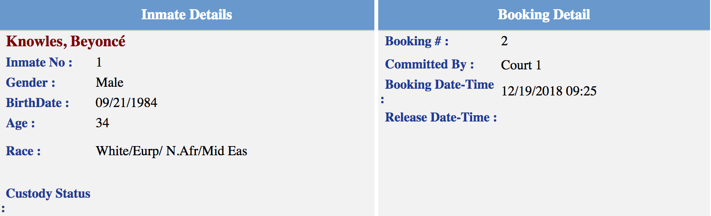
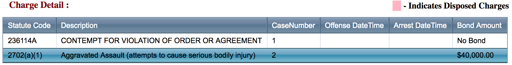

# Data Extractor

The Data Extractor is a set of tools designed to make the extraction of data
from a file, such as an html page or JSON object, much simpler.  At a high
level the data extractor takes a file, and attempts to extract values from
provided keys so the user doesn't need to worry about walking the object to
get data they need.  It will smartly find all of the keys the user lists and
map them to the correct fields in the `ingest_info` object.  The result is a
structured, typed, populated object containing the information that exists on a
page.

There are currently three classes of data extractors:
 - [HtmlDataExtractor](/recidiviz/ingest/extractor/html_data_extractor.py),
   which takes a webpage and walks tables, labeled elements and elements
   identified by css selectors.
 - [JsonDataExtractor](/recidiviz/ingest/extractor/json_data_extractor.py),
   which takes a JSON object or array and looks for the provided fields.
 - [CsvDataExtractor](/recidiviz/ingest/extractor/csv_data_extractor.py),
   which takes CSV-formatted text and looks for the provided columns.

## How To Use the HtmlDataExtractor

### The Yaml File

The first step is to create a yaml file which contains all of the keys that you care about, and how they map to the underlying ingestion object fields.  To see a listing of all of the possible fields and their descriptions, see [IngestInfo](https://github.com/Recidiviz/pulse-data/tree/main/recidiviz/ingest/models/README.md).  

#### key_mappings

The first piece to fill in is the `key_mappings`.  Specifically this is data on a page that is listed as single key value pairs on a web page.  That is one value per key.  An example is the following:

<div align="center"></div>

The resulting `key_mappings` in the yaml is:

```yaml
key_mappings:
  Inmate No: person.person_id
  Gender: person.gender
  BirthDate: person.birthdate
  Age: person.age
  Race: person.race
  Committed By: booking.hold
  Booking Date-Time: booking.admission_date
  "Booking #": booking.booking_id
  Sentence Length: [sentence.min_length, sentence.max_length]
```

Some special cases:
 - the left-hand side may require double-quotes (`""`) if there are special
   characters in the key
 - the right-hand side may be a list of values (`[a, b]`) if the same field
   should map to multiple IngestInfo values

Note that in this case, this particular site has fields for custody status and release date-time, but in fact they are never populated.  We want to let the data extractor know to ignore these fields.

#### keys_to_ignore
The next thing that needs to be filled out is the `keys_to_ignore`.  This tells the data extractor to ignore these fields and not try to extract them.  The important thing to consider here is that the specific key should be ignored for all extractions.  This can be used for fields such as height, weight, hair colour, etc... because they do not map to anything in our internal database and we don't care about them.  The `keys_to_ignore` for the yaml file would be:

```yaml
keys_to_ignore:
  - Custody Status
  - Release Date-Time
```

In this case, these two fields do in fact map to our database, but this particular website never fills it in so we just tell the extractor to ignore it.  We could have mapped it if we wanted, but it would just always be returned as empty.

#### css_key_mappings

In the example above, the person's name does not have a key that we can tell the extractor to use.  The user could use the extractor to fill in all of the fields, and then manually extract the name using html parsing.  However, we also support `css_key_mappings` for this reason.  Similar to `key_mappings`, the user can list any css keys to also be extracted.  In the example above the css for the name looks like:
```html
<span id="ctl00_ContentPlaceHolder1_spnInmateName" class="name">
	Knowles, Beyoncé
</span>
```

We can update our yaml with:

```yaml
css_key_mappings:
  "#ctl00_ContentPlaceHolder1_spnInmateName": person.fullname
```

This lets you avoid extracting the value manually.  

#### multi_key_mapping

The final thing to fill out in the yaml is the `multi_key_mapping`.  Some fields are a one to many mapping.  For example, a person has multiple charges and the list of charges is listed in a table.  Therefore, there isn't just one value, but many values that need to be scraped for a single key.  Here is an example from the same webpage that lists a person's charges:

<div align="center"></div>

The final yaml for the entire webpage becomes:

```yaml
key_mappings:
  Inmate No: person.person_id
  Gender: person.gender
  BirthDate: person.birthdate
  Age: person.age
  Race: person.race
  "Booking #": booking.booking_id
  Committed By: booking.hold
  Booking Date-Time: booking.admission_date
  Sentence Length: [sentence.min_length, sentence.max_length]

css_key_mappings:
  "#ctl00_ContentPlaceHolder1_spnInmateName": person.fullname

keys_to_ignore:
  - Custody Status
  - Release Date-Time
  - Offense DateTime
  - Arrest DateTime

multi_key_mapping:
  Statute Code: charge.statute
  Description: charge.name
  CaseNumber: charge.case_number
  Bond Amount: bond.amount
```

Note that we added Offense DateTime and Arrest DateTime to the ignored keys because they are also always empty.  This simple yaml file allows us to easily look at a webpage and tell the data extractor how to extract the fields.  The user doesn't need to worry about any HTML parsing!

#### `get_value()`
The HtmlDataExtractor exposes an additional API, used to get one value from a
key *after* extract_and_populate_data is called. For example, a key in 
`key_mappings` can be mapped to no value and then accessed later with 
`get_value`.

## How To Use the JsonDataExtractor

The `JsonDataExtractor` works like the `HtmlDataExtractor`, but
only requires one field in the yaml. All keys will be listed under
`key_mappings` and will contain the full path to the field in the JSON
object or array.

For example, consider the following JSON object:
```json
{
  "person": {
    "name": "LAST, FIRST"
  },

   "bookings": [
    {
      "admission date": "1/1/1111",
      "charges": [
        {"id": "345309", "description": "charge name 1"},
        {"id": "894303", "description": "charge name 2"}
      ]
    }
  ]
}
```

The yaml file for this object is as follows:
```yaml
key_mappings:
  person.name: person.full_name

  "bookings.admission date": booking.admission_date

  bookings.charges.id: charge.charge_id
  bookings.charges.description: charge.name
```

The left side of each line should contain the full path to the field, 
separated by dots (`.`). For example, the `name` field is located at
`object['person']['name']` and so the left side should be `person.name`. This
works for paths that include array elements by ignoring the indices. For 
example, since `bookings.charges` is a list, charge IDs are located at
`object['bookings']['charges'][0]['id']` and
`object['bookings']['charges'][1]['id']`, but the left side can omit the indices
and just write `bookings.charges.id`.

The right side of each line should contain the name of the `IngestInfo`
object and the name of that object's field, separated by a dot (`.`). This
is the same as in the `HtmlDataExtractor`.

## How To Use the CsvDataExtractor

The `CsvDataExtractor` is similar to other extractors, but supports unique
features that allow for extracting content related to a group of entities from
across multiple different files. A single row can contain information about
multiple different entities. Typically, keys will be listed under `key_mappings`
and will contain the name of the column in the CSV text.

For example, consider the following CSV text:
```csv
First,Middle,Last,Some extra field
A,B,C,Junk
X,Y,Z,
```

The yaml file for this object is as follows:
```yaml
key_mappings:
  First: state_person.given_names
  Middle: state_person.middle_names
  Last: state_person.surname

keys_to_ignore:
  - "Some extra field"
```

The left side of each line should match one of the headers in the CSV text.

The right side of each line should contain the name of the `IngestInfo` object
and the name of that object's field, separated by a dot (`.`). This is the
same as other data extractors.

All columns in the CSV file must be accounted for, so to explicitly skip
a column, list it as part of `keys_to_ignore` (as in the above example).

### Csv-Specific Mappings

For an example of a scraper using all of these specific features, check out the
`us_nd_scraper` which ingests data across several incoming CSV files at a time.

The CSV data extractor includes a few unique mapping sections. Three of these
are `ancestor_keys`, `primary_key`, `child_key_mappings`, and `ancestor_gap`.

#### ancestor_keys and primary_key

```yaml
key_mappings:
  SENTENCE_ID: state_incarceration_sentence.state_incarceration_sentence_id
  IN_OUT_STATUS: state_incarceration_sentence.status

ancestor_keys:
  ROOT_PERSON_ID: state_person.state_person_id
  GROUP_ID: state_sentence_group.state_sentence_group_id

primary_key:
  SENTENCE_ID: state_incarceration_sentence.state_incarceration_sentence_id
```

`ancestor_keys` and `primary_key` are used to help stitch together `IngestInfo`
object trees that may be distributed across multiple rows and files. In the
example above, a file contains columns for `state_incarceration_sentence`,
including its primary key, and also has columns pointing to the parent
`state_sentence_group` and the grandparent `state_person`.

Specifically:

* `ancestor_keys` includes references to ancestor entities that this row
is updating/creating a child for. If an ancestor entity with the given id has
already been instantiated, and the ancestor is the direct parent of this child,
then this will attach the child to that ancestor. If the ancestor has been 
instantiated but is not a direct parent, and we don't know the id of any gaps 
in the ancestor chain, new empty objects will be created to fill the gaps and 
the child will be attached to its new parent, within the tree of the ancestor.
If the ancestor entity has not yet been instantiated, a new ancestor entity will
be created (and attached to its own ancestor, if known), and the child will be 
attached to the ancestor or within its tree, as described previously. This may 
be omitted if this file does not contain any ancestor information. If the 
`ancestor_keys` is omitted and and an object with a matching `primary_key` has
not already been instantiated, we pick the most recent object with a matching
parent type.

* `primary_key` includes the column name that matches to the main id for this
entity. This is used to ensure the primary id is set on the entity when it is
first created, regardless of which field it is first created with, to help in
locating this object later. This may be omitted if a `primary_id_coordinates_override_callback`
(see below) is defined for this file. The data extractor will assert if you 
do not define either a `primary_key` or `primary_id_coordinates_override_callback`.

#### child_key_mappings

If a file predominantly contains information for a parent entity, but also has
a field for a child entity which will be ingested by a later file, that child
entity can be instantiated and attached to the parent entity during processing 
of this row via `child_key_mappings`. 

For example, consider the following CSV text:
```csv
GROUP_ID,CASE_ID,CHARGE_SEQ,CHARGE_STATUS,COMMENT_TEXT,DESCRIPTION,INITIAL_COUNTS,OFFENCE_CODE,OFFENCE_DATE_RANGE,OFFENCE_TYPE,OFFENSE_DATE,CREATE_DATETIME,MODIFY_DATETIME
105640,5190,1,A,,KIDNAPPING,1,1801,,FB,6/19/89  12:00:00 AM,12/6/14  12:23:51 PM,
```

This contains information mostly about a `StateCharge`, but also has a field for
the downstream `CourtCase`. The YAML for this file is as follows:
```yaml
key_mappings:
  CHARGE_STATUS: state_charge.status
  OFFENSE_DATE: state_charge.offense_date
  OFFENCE_CODE: state_charge.statute
  DESCRIPTION: state_charge.description
  OFFENCE_TYPE: state_charge.classification_type
  INITIAL_COUNTS: state_charge.counts
  COMMENT_TEXT: state_charge.charge_notes

ancestor_keys:
  GROUP_ID: state_sentence_group.state_sentence_group_id

child_key_mappings:
  CASE_ID: state_court_case.state_court_case_id

keys_to_ignore:
  - CREATE_DATETIME
  - MODIFY_DATETIME
```

When the `CASE_ID` column is processed, if it has a value then `StateCharge.court_case`
will be created immediately, with the value of that column set on `court_case_id`.
Importantly, the primary key for the parent entity in the file, `state_charge`
in this case, will be included in the ancestor chain of any new child entities,
whether that primary key comes from `primary_key` or a callback as described
below.

#### enforced_ancestor_types

If a file contains information for some entity and includes an `ancestor_keys`
for an ancestor that's not the direct parent, and the entity being extracted has
multiple potential parent types between itself and the noted ancestor (e.g. if
the entity is a `state_charge` and the `ancestor_keys` points to `state_sentence_group`
then in between the two could be either `state_incarceration_sentence` or
`state_supervision_sentence`). `enforced_ancestor_types` can be
used in these situations to explicitly declare what the parent should be, from
context.

For example:
```yaml
key_mappings:
  CASE_ID: state_court_case.state_court_case_id
  CASE_STATUS: state_court_case.status
  CONVICTION_DATE: state_court_case.date_convicted
  COURT_DATE: state_court_case.next_court_date
  COUNTY_CODE: state_court_case.county_code
  JUDGE_NAME: state_court_case.judge_name

ancestor_keys:
  OFFENDER_BOOK_ID: state_sentence_group.state_sentence_group_id

enforced_ancestor_types:
  state_sentence: state_incarceration_sentence

primary_key:
  ORDER_ID: state_court_case.state_court_case_id

keys_to_ignore:
  - CREATE_DATETIME
  - MODIFY_DATETIME
```

In this case, the mapping is used to extract `state_court_case` entities, but we
only have a key for `state_sentence_group`, which is the great-grandparent. The
grandparent can be any of the state sentence types (hence `state_sentence`; see
`ingest_object_hierarchy.py` for a set of valid ancestor choice keys), and then
the parent will be `state_charge`. `enforced_ancestor_types` is explicitly set
to `state_incarceration_sentence` because it is known that this file provides
information on cases that lead to sentences of incarceration. If there are
multiple ancestor levels for which a specific type must be explicitly set, that
can be done with multiple entries in the `enforced_ancestor_types` mapping.

### Csv-Specific Callbacks

The CSV data extractor also includes a few callbacks that can be passed into the
extractor's constructor, to inject dynamic behavior during extraction runtime.
Because these callbacks are passed into the constructor, they are immutable 
state for an extractor. For this reason, it is generally advised to instantiate 
a new CSV data extractor for each individual file you would like to ingest.

The callbacks are as follows:

* `row_pre_hooks` - a list of hooks that will be processed on each row
~before~ it is ingested by the extractor. They will be invoked in order with the
content of the row itself. It should make any necessary modifications in-place 
to the row itself and should not return anything. The interface is:
```python
def my_row_pre_hook(file_tag: str, row: Dict[str, str]):
    # Do my stuff
```


* `row_post_hooks` - a list of hooks that will be processed on each row
ingested by that extractor. They will be invoked in order with the content of 
the row itself, the list of `IngestObjects` that were created or updated during
processing of the row, and the current state of the `IngestInfo`. It should not
return anything. The interface is:
```python
def my_row_post_hook(file_tag: str, 
                     row: Dict[str, str],
                     updated_objects: List[IngestObject],
                     ingest_info: IngestInfo):
    # Do my stuff
```

* `primary_key_override_callback` - a callback which is called before a row is 
processed, dynamically setting the primary key for the entity to be updated by
the row. This overrides any `primary_key` mapping in the yaml file. It will be
invoked with the content of the row itself, and must return an
`IngestFieldCoordinates` object. The interface is:
```python
def my_primary_key_override_callback(file_tag: str, 
                                     row: Dict[str, str]) -> IngestFieldCoordinates:
    return IngestFieldCoordinates(primary_class, primary_field, primary_id)
```

* `ancestor_chain_overrides_callback` - a callback which is called before a row is 
processed, which returns any subset of the `ancestor_keys` used locate the entity to
be updated by the row. These are inserted into the `ancestor_keys` map derived
from the `ancestor_keys` mapping in the yaml file, overriding any entry in the 
map with the same class key. It will be invoked with the row, and must return a 
dictionary with mappings from ancestor types type (strings) to the primary key of 
an instance of that type. The interface is:
```python
def my_ancestor_chain_overrides_callback(file_tag: str, 
                                         row: Dict[str, str]) -> Dict[str, str]:
    return {parent_type: parent_id}
```

## The Code

Now that the yaml is written, the last step is to tell the scraper to use the extractor.  This process is simple, the first step is to import the data extractor:
```python
from recidiviz.ingest.extractor.html_data_extractor import HtmlDataExtractor
```
or
```python
from recidiviz.ingest.extractor.json_data_extractor import JsonDataExtractor
```
or
```python
from recidiviz.ingest.extractor.csv_data_extractor import CsvDataExtractor
```


Next, get the directory of the yaml, which should be saved in your region's directory:

```python
def __init__(self):
      self.yaml_file = os.path.join(os.path.dirname(__file__), 'my_yaml.yaml')
```

Finally, use the data extractor in the `populate_data` function:

```python
def populate_data(self, content, params,
                  ingest_info: IngestInfo) -> Optional[ScrapedData]:
        """
        Populates the ingest info object from the content and params given

        Args:
            content: An lxml html tree.
            params: dict of parameters passed from the last scrape session.
            ingest_info: The IngestInfo object to populate
        """
        data_extractor = HtmlDataExtractor(self.yaml_file)
        data_extractor.extract_and_populate_data(content, ingest_info)
        return ScrapedData(ingest_info=ingest_info, persist=True)
```

The data extractor will have a properly formatted object that you shouldn't need to touch. Note:  In some cases you may need to do some additional work on the `ingest_info` object (if a field couldn't be extracted properly), but in most cases we prefer to expand the functionality of the data extractor to handle the case.

## When Does It Work?

The data extractor works in a wide range of cases.  It works in the following situations:
* A page that has data displayed in a table, whether well-structured or poorly structured
	* The 'value' can appear to the right cell, or the cell below the key
	* The values don't have to be consistently displayed, for example one value can be in the lower cell, and another can be in the right cell on the same page
* Unstructured key-value pairs that are separated by a ':' and not in a table
* It can handle multiple people per page

The general rule of thumb is to attempt to the use the data extractor and ask questions later.  In most cases it'll just work!

## When Doesn't It work

The data extractor sometimes fails with very oddly structured data.  It is hard to enumerate these examples as we have not encountered them all.  There are cases when the data is displayed in a table that has many nested tables (it still catches most of these cases) resulting in data extraction errors.  

Another current failure is when data for a single person is on many pages.  For example if their booking information is on one page, but to get at their charge information you need to click through to another page.  This behaviour is untested but a user can attempt to create two yaml files, one per page and use those to  populate the `ingest_info` object.  The data extractor should properly update the object that is passed in but use at your own risk!  We plan to test and expand this functionality in the future.  
