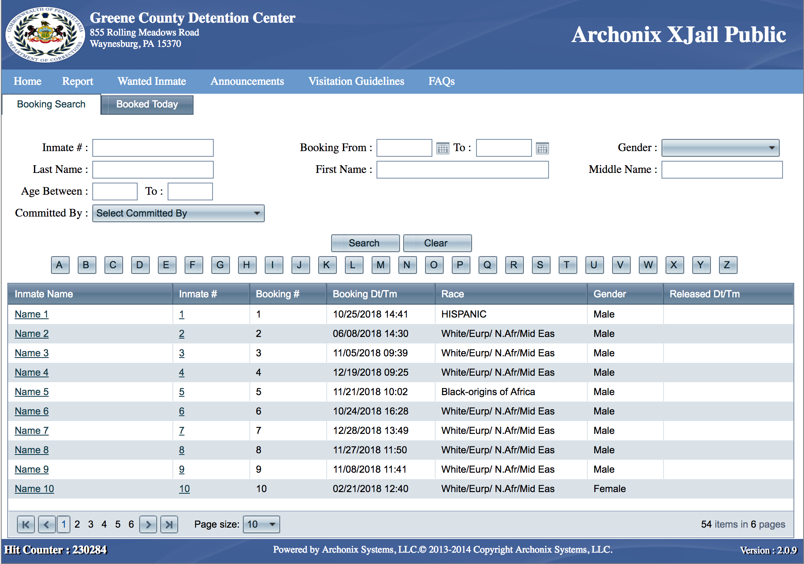

Creating a Scraper
==================
Before doing anything, setup your environment by running `pipenv install` in the top level directory.
Enter your environment with `pipenv shell `. Finally, test that your system is all setup for scraper
development by running an existing scraper using, say
`python -m recidiviz.ingest.run_scraper --region us_pa_greene`.

Next you'll be ready to create the scraper.

From the top level `pulse-data` directory, run the `create_scraper.py`
script to create the relevant files for a new scraper.

### Usage
`python create_scraper.py <county> <state> <county_type>`

County type describes the type of data the website has, and can be one of the following:
1. `jail` (majority of scrapers will be for jails)
1. `prison`
1. `unified` - contains both jail and prison data

For example:
`python create_scraper.py kings ny jail`

Multi-word counties should be enclosed in quotes:
`python create_scraper.py 'prince william' virginia jail`

###### Optional Arguments
 - `agency`: the name of the agency, e.g. `Foo County Sheriff's Office`
 - `timezone`: the timezone, e.g. `America/New York`
 - `url`: the initial url of the roster

For example:
`python create_scraper.py lake indiana jail --timezone='America/Chicago'`


Initial Setup
=============
The script will create the following files in the directory
`recidiviz/ingest/<region_code>`:
 - `<region_code>_scraper.py`
 - `__init__.py`
 - `<region_code>.yaml`

It will also create a test file
`recidiviz/tests/ingest/<region_code>/<region_code>_scraper_test.py`.

In addition, the script will append the region to [queue.yaml](/queue.yaml)
and [region_manifest.yaml](/region_manifest.yaml).

You will need to manually edit the following files:
 - In [`recidiviz/ingest/__init__.py`](/recidiviz/ingest/__init__.py), add an
   `import` statement for your scraper.
 - In [`recidiviz/tests/ingest/ingest_utils_test.py`](/recidiviz/tests/ingest/ingest_utils_test.py),
   add your region to `test_validate_regions_multiple_all` and `test_validate_regions_one_all`


Writing the main scraper file
=============================
You will write most of the scraping logic in `<region_code>_scraper.py`. The
scraper should inherit from [BaseScraper](../base_scraper.py) or a
[vendor scraper](../vendors) and must implement the following functions:
 - `__init__(self, region_name, mapping_filepath=None)`
 - `get_more_tasks(self, content, task: Task) -> List[Task]`
 - `populate_data(self, content, task: Task, ingest_info: IngestInfo) -> Optional[IngestInfo]`

Navigation, if necessary, is implemented in `get_more_tasks`, while
scraping information about people is handled in `populate_data`.


Navigation
----------

Navigation is handled in `get_more_tasks`. The basic question to answer is, given a webpage,
how do I navigate to the next set of pages?  This information is encapsulated
in the `Tasks` that are returned. A `Task` requires the following fields:

* `endpoint`: The url endpoint of the next page to hit
* `task_type`: Defines the type of action we will take on the next page

By default this will cause a GET request against the given endpoint. Other fields, such as `post_data`, can be set in the `Task` to modify the requst that is sent. The user can set custom key/values that are useful to them in the `custom` field which will be passed along to the next tasks. See [`Task`](../task_params.py) for information about all of the fields.

The different types of tasks are found in the [Constants](../constants.py) file and they are:
* <strong>INITIAL</strong> - This is the first request that is made.
* <strong>GET_MORE_TASKS</strong> - This indicates that the page has more navigation that needs to be done.  In this case, the function `get_more_tasks` is called and it is the job of the method to return a list of params that was extracted from that page.
* <strong>SCRAPE_DATA</strong> - This indicates that the page has information on it that we care about and need to scrape.  In this case `populate_data` is called and it is the users job to walk the page and populate the `ingest_info` object.

By default, the first task is of `INITIAL_AND_MORE` type so that `get_more_tasks` is called for the `INITIAL` task as well. It also navigates to the `base_url` defined in [region_manifest.yaml](/region_manifest.yaml) by default. A different endpoint or other request parameters for the initial task can be provided by overriding `get_initial_task`.

For convenience, there also exists `SCRAPE_DATA_AND_MORE` which calls both `get_more_tasks` as well as `populate_data`.  This can be used when a persons information is spread across multiple pages.  For example their booking data is on one page, and the user must click a link to reach the pages there the charges information is displayed.

_TODO(697): Implement support for serializing and deserializing IngestInfo, such that we can actually handle booking data spread across multiple pages._

#### What is the structure of pages on the website?
Most website rosters follow a couple of familiar formats. For examples, refer to
these scrapers:
 - Data about multiple people on a single page:
   [UsFlMartinScraper](https://github.com/Recidiviz/pulse-data/tree/master/recidiviz/ingest/us_fl_martin)
 - Multiple results pages with links to individual people:
   [BrooksJeffreyScraper](../vendors/brooks_jeffrey/brooks_jeffrey_scraper.py)
 - Data about an individual person spread across multiple pages:
   [TODO(210): link to VT](https://github.com/Recidiviz/pulse-data/issues/210)

Scraping Data
--------
Data is scraped in `populate_data`, which receives an
[IngestInfo](https://github.com/Recidiviz/pulse-data/tree/master/recidiviz/ingest/models/README.rst) object as a parameter, populates it with
data, and returns it as a result.

The [IngestInfo](https://github.com/Recidiviz/pulse-data/tree/master/recidiviz/ingest/models/README.rst) object contains classes that represent
information about a Person, Booking, Arrest, Charge, and Bond.  Read the README linked here to understand
what each of the fields means.

You can populate the IngestInfo object manually, or use the
[DataExtractor](https://github.com/Recidiviz/pulse-data/tree/master/recidiviz/ingest/extractor/README.md) class to populate it
automatically.

### Automatic Data Extraction

The Data Extractor is a tool designed to make the extraction of data from a website much simpler. You should first attempt to use the data extractor as it significantly lowers the line count of your scraper and is far easier to use than trying to parse poorly formatted HTML data.

### Data Persistence

The base logic decides to persist data to the database when we hit a task that scrapes data, and also doesn't need to get more tasks.  In this case, after the ingest info is returned from the `populate_data` call, that person (or people) will be persisted to the database.

Unit Tests
==================
The only two functions that need to be unit tested for your scraper are `get_more_tasks` and `populate_data`.  The unit tests inherit from `BaseScraperTest`. This provides two functions `validate_and_return_get_more_tasks` and `validate_and_return_populate_data`.  Both of these functions take content of a page, the params to send in, and the expected value to be returned.  In addition to calling the relevant function and validating its output against the expected output, it runs extra validations on the returned output to make sure the object is formatted correctly and has all of the required fields.

End To End Tests
==================
To test what your scraper might look like in production, use the `run_scraper` script.  This script simply emulates the flow of your scraper.  This script does not persist any data but it does make real requests so it is a good check to see if your scraper works properly.

To use it simply run:
```shell
$ python -m recidiviz.ingest.run_scraper --region region_name
```
Optional fields are:
* num_tasks: The number of tasks to try before ending the run. The default is 5.
* sleep_between_requests: The seconds to sleep between each request.  The default is 1.

Please be mindful to sleep a reasonable amount of time between each request, we don't want to bring down or degrade any websites!  This can of course run through the entire roster if you set the number of tasks to be high enough, but doing 5-10 is usually reasonable enough.

Resolving Enum Parsing Errors
==================
Although we are populating all fields in `IngestInfo` with scraped strings, later several of those strings are converted into Enums. When running your scraper (either Unit Tests or End to End Tests), you may have encountered an `EnumParsingError: Could not parse X when building <enum Y>` during this process. This indicates that the scraped string could not be parsed into an Enum, in which case you have two options:

### 1. Adding to the default map
If you suspect the new string->Enum mapping should be shared across all scrapers, you should add it to the enum's default map. Enums with their default maps are in the [recidiviz/common/constants/](https://github.com/Recidiviz/pulse-data/tree/master/recidiviz/common/constants) directory.

ex. [#522](https://github.com/Recidiviz/pulse-data/pull/522/)

### 2. Adding a region-specific override
If you suspect the new string->Enum mapping is region-specific and should NOT be shared across all scrapers, you should add an override mapping to your specific scraper by implementing `scraper.get_enum_overrides()`. This method returns a `Dict[str, Enum]`, which contains all mappings specific to the region, regardless of the Enum type. Default maps and Enum values can both be found in [recidiviz/common/constants/](https://github.com/Recidiviz/pulse-data/tree/master/recidiviz/common/constants).


If a string should NOT be mapped to any Enum value, you can map it to None.

ex. [#525](https://github.com/Recidiviz/pulse-data/pull/525/files#diff-e67a771abc537872ae10c6e6aa7fd717)

Example Flow
==================
Lets walk through a website and create an example scraper.

<div align="center"></div>

This is the homepage of a website. `get_more_tasks` is called with this page and by experimentation we see that to get a list of all the people we need to click the search button.  We inspect the network traffic to see what post data needs to be sent and our `get_more_tasks` so far looks like this:

```python
    def get_more_tasks(self, content, task: Task) -> List[Task]:
        task_list = []
        # If it is our first task, we know the next task must be a query to
        # return all people
        if self.is_initial_task(task.task_type):
            task_list.append(Task(endpoint=url_people_search,
                                  task_type=constants.TaskType.GET_MORE_TASKS,
                                  post_data=post_data_if_necessary))
```

We know that by clicking the search button, it takes us to a page where we are not yet ready to scrape any data, hence our task type is GET_MORE_TASKS. The url and post_data need to actually be scraped from the page (they are shown here for simplicity).  Once this is done, `get_more_tasks` will be called again on the following webpage:

<div align="center"></div>

Now that we are on this page, we must expand our `get_more_tasks` function to handle this:

```python
    def get_more_tasks(self, content, task: Task) -> List[Task]:
        task_list = []
        # If it is our first task, we know the next task must be a query to
        # return all people
        if self.is_initial_task(task.task_type):
            task_list.append(Task(endpoint=url_people_search,
                                  task_type=constants.TaskType.GET_MORE_TASKS,
                                  post_data=post_data_if_necessary))
        if self._is_person_list(content):
            # Loop through each url that clicks through to the persons page and
            # append to the task params
            for url, post_data_if_necessary in self._get_all_urls_and_post(content):
                task_list.append(Task(endpoint=url,
                                      task_type=constants.TaskType.SCRAPE_DATA,
                                      post_data=post_data_if_necessary))
            # Also click on next page
            task_list.append(Task(endpoint=url_next_page,
                                  task_type=constants.ResponseType.GET_MORE_TASKS,
                                  post_data=post_data_if_necessary))
```

We detect that we are on a page with a list of people on it, and our task list should contain the URLs for all 10 people on the page.  Our scrape type for those will be SCRAPE_DATA which will call `populate_data` on the content of that page because we are ready to scrape information.  Additionally we also make sure to click next page to ensure we get everyone on the roster list, the scrape type will be GET_MORE_TASKS.  Note that `is_person_list` and `get_all_urls_and_post` are just examples, you will need to implement ways to extracts this information particular to your scraper.  Finally, the person page looks like this:

<div align="center"></div>

Because the task type was SCRAPE_DATA, the function `populate_data` will be called, so we need to implement it.  For this particular example, we will use the data extractor with the following yaml file:

```yaml
key_mappings:
  Inmate No: person.person_id
  Gender: person.gender
  BirthDate: person.birthdate
  Age: person.age
  Race: person.race
  "Booking #": booking.booking_id
  Committed By: booking.hold
  Booking Date-Time: booking.admission_date

css_key_mappings:
  "#ctl00_ContentPlaceHolder1_spnInmateName": person.surname

keys_to_ignore:
  - Custody Status
  - Release Date-Time
  - Offense DateTime
  - Arrest DateTime

multi_key_mapping:
  Statute Code: charge.statute
  Description: charge.name
  CaseNumber: charge.case_number
  Bond Amount: bond.amount
```

Our `populate_data` function looks like:

```python
def populate_data(self, content, task: Task,
                  ingest_info: IngestInfo) -> Optional[IngestInfo]:
        yaml_file = os.path.join(os.path.dirname(__file__), 'my_yaml.yaml')
        data_extractor = DataExtractor(yaml_file)
        data_extractor.extract_and_populate_data(content, ingest_info)
        return ingest_info
```

The process for this is explained in the data extractor [documentation](https://github.com/Recidiviz/pulse-data/tree/master/recidiviz/ingest/extractor/README.md) with examples.  In most cases the data extractor should suffice but if it does not, your `populate_data` function will manually have to walk the html and extract out the relevant fields into the `ingest_info` object.
